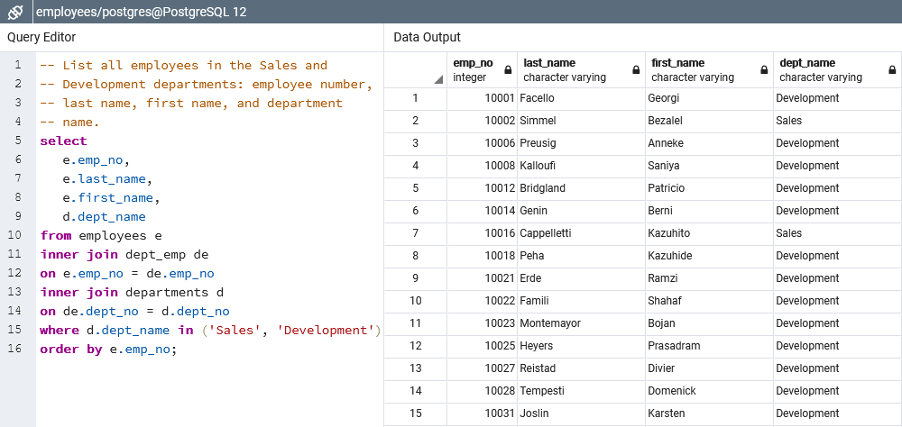

# SQL Exercise - Employee Database

## Data

The resources contains 6 cvs files, all of them containing employees information:

* Personal employees information

    

* Deparments

    

* Employees by department

    

* Managers by deparment

    

* Titles per employee

    

* Salaries per employee

    

### Objective

* Sketch the ERD of the tables.
* Create the table schema for each csv file.
* Run the following queries:
  * List the following details of each employee: employee number, last name, first name, gender, and salary.
  * List employees who were hired in 1986.
  * List the manager of each department with the following information: department number, department name, the manager's employee number, last name, first name, and start and end employment dates.
  * List the department of each employee with the following information: employee number, last name, first name, and department name.
  * List all employees whose first name is "Hercules" and last names begin with "B."
  * List all employees in the Sales department, including their employee number, last name, first name, and department name.
  * List all employees in the Sales and Development departments, including their employee number, last name, first name, and department name.
  * In descending order, list the frequency count of employee last names, i.e., how many employees share each last name.
* Import the database into pandas and:
  * Create a histogram to visualize the most common salary ranges for employees.
  * Create a bar chart of average salary by title.

## Results

* Sketch the ERD of the tables.

    

* The table schema can be found [here](schema.sql).
* Run the following queries:
  * List the following details of each employee: employee number, last name, first name, gender, and salary.

     

  * List employees who were hired in 1986.

     

  * List the manager of each department with the following information: department number, department name, the manager's employee number, last name, first name, and start and end employment dates.
  
     

  * List the department of each employee with the following information: employee number, last name, first name, and department name.
  
     

  * List all employees whose first name is "Hercules" and last names begin with "B."
  
     

  * List all employees in the Sales department, including their employee number, last name, first name, and department name.
  
     

  * List all employees in the Sales and Development departments, including their employee number, last name, first name, and department name.
  
     

  * In descending order, list the frequency count of employee last names, i.e., how many employees share each last name.
  
     

* The next analysis can be found [here](analysis.ipynb)
  * Create a histogram to visualize the most common salary ranges for employees.

    

  * Create a bar chart of average salary by title.

    

## Copyright

Photo by [Rob Gonyea](https://www.freeimages.com/photographer/rob_gonyea-59290) from [FreeImages](https://freeimages.com/).
